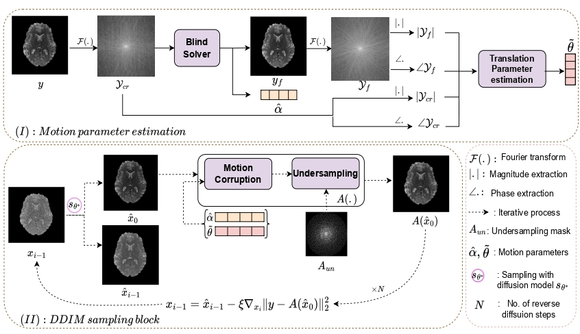

# AutoDPS: An Unsupervised Diffusion Model Based Method for Multiple Degradation Removal in MRI


## Abstract
Background and Objective: Diffusion models have demonstrated their ability in image generation and solving inverse problems like restoration. Unlike most existing deep-learning based image restoration techniques which rely on unpaired or paired data for degradation awareness, diffusion models offer an unsupervised degradation independent alternative. This is well-suited in the
context of restoring artifact-corrupted Magnetic Resonance Images (MRI), where it is impractical to exactly model the degradations apriori. In MRI, multiple corruptions arise, for instance, from patient movement compounded by undersampling artifacts from the acquisition settings.
Methods: To tackle this scenario, we propose AutoDPS, an unsupervised method for corruption removal in brain MRI based on Diffusion Posterior Sampling. Our method (i) performs motion-related corruption parameter estimation using a blind iterative solver, and (ii) utilizes the knowledge of the undersampling pattern when the corruption consists of both motion and undersampling artifacts. We incorporate this corruption operation during sampling to guide the generation in recovering high-quality images.
Results: Despite being trained to denoise and tested on completely unseen corruptions, our method AutoDPS has shown ∼ 1.63 dB of improvement in PSNR over baselines for realistic 3D motion restoration and ∼ 0.5 dB of improvement for random motion with undersampling. Additionally, our experiments demonstrate AutoDPS’s resilience to noise and its generalisation capability under domain shift, showcasing its robustness and adaptability.
Conclusion: In this paper, we propose an unsupervised method that removes multiple corruptions, mainly motion with undersampling, in MRI images which are essential for accurate diagnosis. The experiments show promising results on realistic and composite artifacts with higher improvement margins as compared to other methods.




## Training
In order to train your model follow: [guided-diffusion](https://github.com/openai/guided-diffusion).

## Inference
For inference on HCP make the below changes in ```sample.sh```,

- Set model path in ./configs/model_config.yaml and add in  --model_config

- Choose the desired degradation config file from ./configs and add in --task_config

- Set output directory at --save_dir.
        -
Run 
```
bash sample.sh
```

### Install dependencies

```
pip install -r ./requirements_autodps.txt
```

